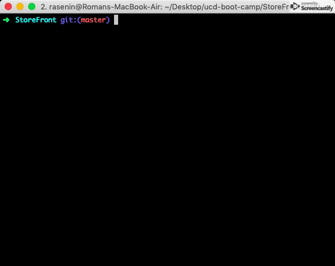

# StoreFront

`Store simulation app. "Buy" items from a database on your own machine.`

To set up and use the app:
  1. Download/Clone the repository and navigate to it.
  1. Open the `bamazonCustomer.js` file in a text editor and locate the following block of code starting at line 5:
      ```javascript
      let connection = mysql.createConnection({
        host: "localhost",
        port: 3306,
        user: "root",
        password: "root",
        database: "bamazon"
      });
      ```
      Replace "root" in the line
      ```javascript
      password: "root",
      ```
      with your MYSQL password.
  1. Start your MYSQL Server.
  1. Run the `bamazon.sql` file to fill the database with the items that will be for sale (CAUTION: make sure `bamazon` isn't a database name already in use on your machine).
  1. Run these two commands within your terminal:
      ```bash
      npm install
      npm start
      ```
  1. Visit http://localhost:3000 in your browser
The following gif demonstrates some of the functionality:



---
### Technologies Used:
* inquirer.js
* MYSQL
